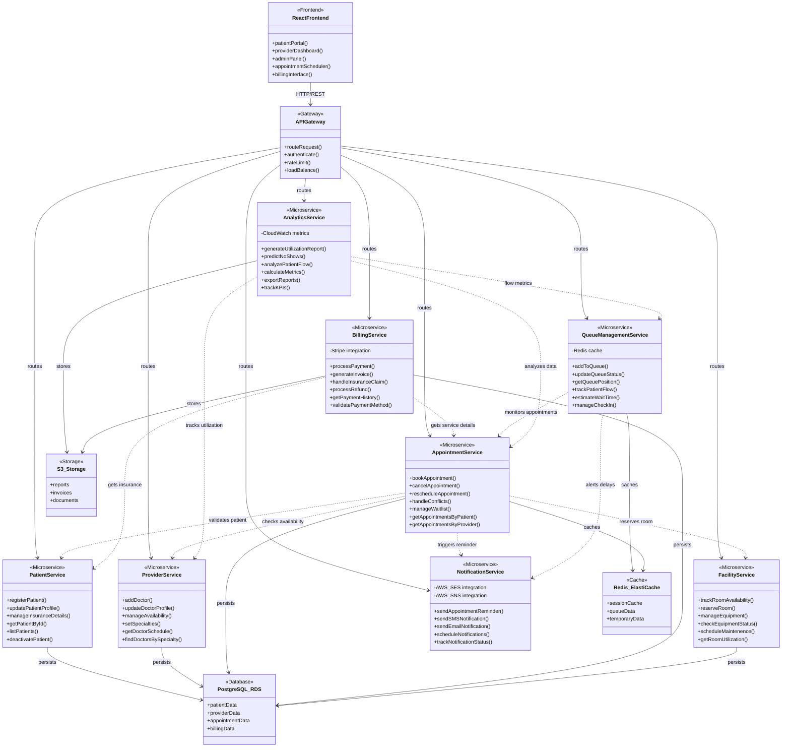

# MediSync  
Distributed Healthcare Appointment & Resource Management Platform

MediSync is a microservices-based healthcare system that optimizes appointment scheduling, doctor availability, facility usage, patient flow, notifications, billing, and analytics. Built with **Spring Boot**, and **AWS**.

---

## Features
- Patient Service – Manage patient profiles, insurance details  
- Provider Service – Manage doctors, availability, and specialties  
- Appointment Service – Book appointments, handle conflicts & waitlists  
- Facility Service – Track rooms & equipment availability  
- Queue Management Service – Real-time patient flow tracking via Redis  
- Notification Service – Send reminders via AWS SES (email) & SNS (SMS)  
- Billing Service – Process payments (simulated with Stripe sandbox)  
- Analytics Service – Utilization reports, no-show predictions, CloudWatch metrics  

---

## Architecture
- Backend: Spring Boot (8 microservices)  
- Database: AWS RDS (PostgreSQL)  
- Cache/Queue: AWS ElastiCache (Redis)  
- Storage: AWS S3 (reports, invoices)  
- Messaging: AWS SNS/SES (notifications)  
- Frontend: React


## Quick Start (Local)
### Prerequisites
- Java 17+  
- Maven 3+  
- Docker (for PostgreSQL & Redis locally)  
- AWS Free Tier account (for deployment)  

### Run Locally
```bash
# Clone repository
git clone https://github.com/Adharsh-Rengarajan/medisync.git
cd medisync

# Build all services
mvn clean install

# Run a service (example: Patient Service)
cd patient-service
mvn spring-boot:run
